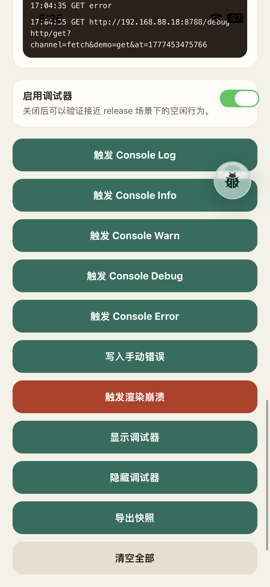
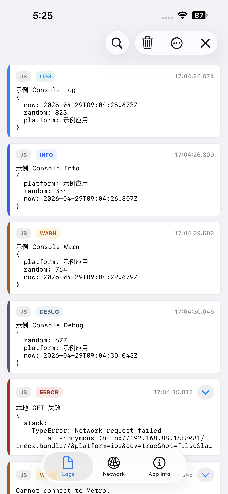
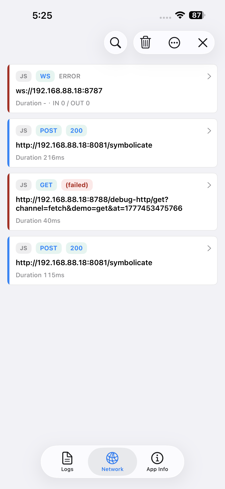
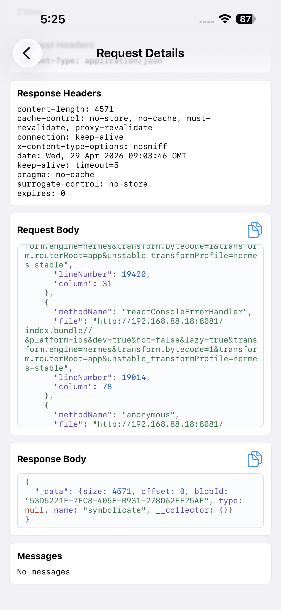
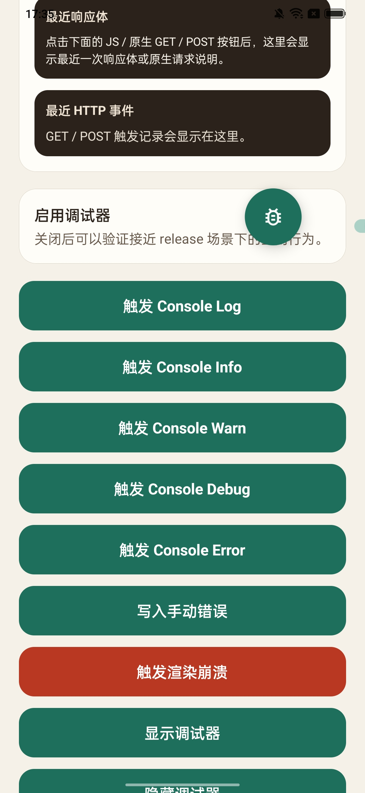
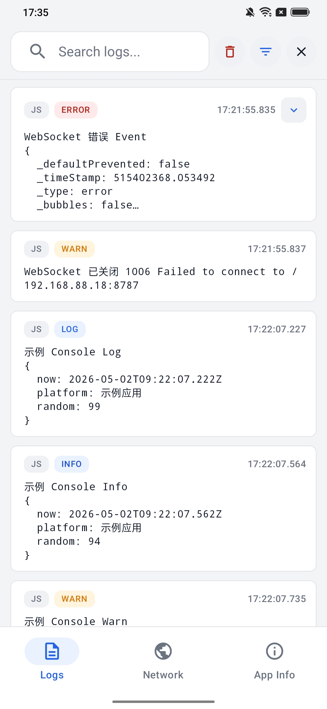
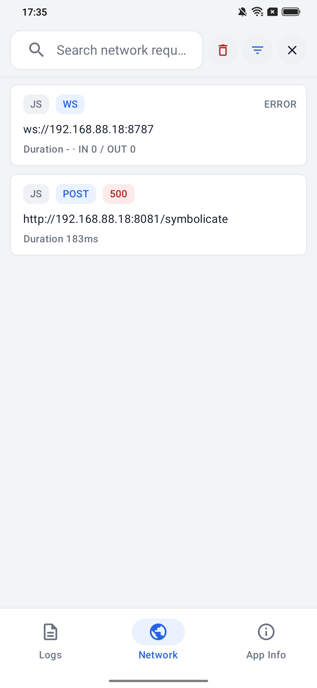
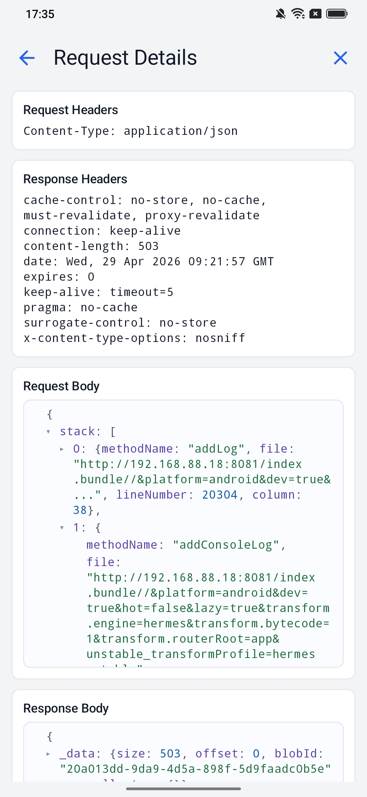

# expo-inapp-debugger

[中文](#中文) · [English](#english)

Native in-app debugger for Expo and React Native apps.

It adds a small native floating entry inside your app. When enabled, you can inspect JS logs, React errors, global exceptions, network requests, WebSocket activity, native logs, native network hints, and basic app/runtime information directly on the device.

> This package includes iOS and Android native code. Expo Go is not supported. Use Expo Dev Client, Expo prebuild, or bare React Native.

---

## English

### Highlights

- **On-device debugging**: inspect logs, errors, network requests, WebSocket events, and app info without attaching a computer.
- **Expo / React Native friendly**: works with Expo Dev Client, Expo prebuild, and bare React Native projects.
- **Production-gated by design**: keep the package in production builds, then enable it only for trusted users or hidden debug flows.
- **Low idle overhead**: when `enabled={false}`, collectors are not installed and the runtime stays asleep.
- **Opt-in native capture**: native logs and native network collection are disabled by default and can be temporarily enabled from App Info.
- **Localized UI**: supports `en-US`, `zh-CN`, `zh-TW`, `ja`, and custom strings.

### Screenshots

These screenshots show selected pages and features from the example Expo app using this library.

| Platform | Debug entry | Logs | Network | Request details |
| --- | --- | --- | --- | --- |
| iOS |  |  |  |  |
| Android |  |  |  |  |

### Installation

```bash
pnpm add expo-inapp-debugger
```

Other package managers also work:

```bash
npm install expo-inapp-debugger
yarn add expo-inapp-debugger
bun add expo-inapp-debugger
```

Rebuild the native app after installation:

```bash
npx expo prebuild
npx expo run:ios
# or
npx expo run:android
```

For bare React Native projects, follow your existing CocoaPods / Gradle rebuild flow.

### Quick Start

The simplest integration is `InAppDebugRoot`:

```tsx
import { InAppDebugRoot } from 'expo-inapp-debugger';

export default function Root() {
  return (
    <InAppDebugRoot enabled={__DEV__} locale="en-US">
      <App />
    </InAppDebugRoot>
  );
}
```

`InAppDebugRoot` is equivalent to `InAppDebugProvider + InAppDebugBoundary`. It is convenient when you want the debugger and the built-in React Error Boundary together.

For production builds, `InAppDebugProvider` is usually the safest default because it does not change your app's React error handling semantics:

```tsx
import { InAppDebugProvider } from 'expo-inapp-debugger';

export default function Root() {
  return (
    <InAppDebugProvider enabled={__DEV__} locale="en-US">
      <App />
    </InAppDebugProvider>
  );
}
```

### Integration Choices

| API | Best for | Host app behavior | Disabled overhead |
| --- | --- | --- | --- |
| `InAppDebugProvider` | Production-safe integration | Does not add a React Error Boundary | Very low |
| `InAppDebugRoot` | Fastest setup | Adds the built-in React Error Boundary | Low |
| `InAppDebugBoundary` | Boundary-only usage | Captures React render errors and renders fallback UI | Independent from debugger state |

`enabled` is the authoritative switch when `InAppDebugProvider` is mounted. Only when it becomes `true` will the debugger runtime be created and React Native collectors installed.

Native logs and native network capture are still opt-in. They are disabled by default and can be enabled from the App Info panel or through explicit Provider props.

### Production Gating

You can ship the package in production, but the recommended pattern is to bind `enabled` to a trusted business switch instead of enabling it for every user.

Good activation patterns include:

- Tap a hidden area 5-10 times, such as the app version row on the About screen.
- Enter a temporary debug passphrase in a specific internal input field.
- Enable it only for internal accounts, QA users, or devices allowed by remote config.
- Combine a local gesture with server-side permission so random users cannot discover it accidentally.
- Turn it off immediately after the debugging session ends.

Recommended production priority:

1. **Lowest overhead**: do not import or mount the debugger until the trusted gate passes.
2. **Balanced**: import the package, but mount `InAppDebugProvider enabled={debuggerEnabled}`.
3. **Simplest**: use `InAppDebugRoot` if you accept the built-in Error Boundary behavior.

If you want the non-enabled path to be as close to zero cost as possible, defer the import until the gate passes:

```tsx
export default function Root() {
  const debuggerEnabled =
    isInternalUser && remoteConfig.inAppDebuggerEnabled;

  if (!debuggerEnabled) {
    return <App />;
  }

  const { InAppDebugProvider } = require('expo-inapp-debugger');

  return (
    <InAppDebugProvider enabled locale="en-US">
      <App />
    </InAppDebugProvider>
  );
}
```

If you prefer normal static imports, keep `enabled` off for ordinary users:

```tsx
import { InAppDebugProvider } from 'expo-inapp-debugger';

export default function Root() {
  const debuggerEnabled =
    isInternalUser && remoteConfig.inAppDebuggerEnabled;

  return (
    <InAppDebugProvider enabled={debuggerEnabled} locale="en-US">
      <App />
    </InAppDebugProvider>
  );
}
```

### Performance Notes

- For typical applications, keeping the package installed does not create user-noticeable performance impact when the debugger is gated correctly.
- With `enabled={false}`, the debugger stays in a dormant path: no JS log/network hooks are installed and no native collection is started. The impact is effectively close to zero and can usually be ignored.
- When enabled, the debugger intentionally does work: it records logs, errors, requests, and UI state for debugging. Enable it only for targeted sessions.
- Native logs and native network capture are heavier than JS-only capture, so they are opt-in and should be turned on temporarily.
- Avoid unbounded buffers. Keep `maxLogs`, `maxErrors`, and `maxRequests` reasonable for your app.
- Prefer fixed hidden activation flows, then disable the debugger when it is no longer needed.

### Provider Options

```tsx
<InAppDebugProvider
  enabled={__DEV__}
  initialVisible
  enableNetworkTab
  enableNativeLogs={false}
  enableNativeNetwork={false}
  maxLogs={2000}
  maxErrors={100}
  maxRequests={100}
  locale="en-US"
>
  <App />
</InAppDebugProvider>
```

| Prop | Default | Description |
| --- | --- | --- |
| `enabled` | `false` | Enables the debugger runtime and collectors. |
| `initialVisible` | `true` | Shows the native floating entry when enabled. |
| `enableNetworkTab` | `true` | Enables the network panel and JS network collection. |
| `enableNativeLogs` | `false` | Starts native log capture immediately. Usually keep this off and enable temporarily from App Info. |
| `enableNativeNetwork` | `false` | Starts native network capture immediately. Usually keep this off and enable temporarily from App Info. |
| `maxLogs` | `2000` | Maximum number of log entries kept in memory/native store. |
| `maxErrors` | `100` | Maximum number of error entries kept. |
| `maxRequests` | `100` | Maximum number of network entries kept. |
| `locale` | `auto` | UI locale: `auto`, `en-US`, `zh-CN`, `zh-TW`, or `ja`. |
| `strings` | - | Partial custom UI strings. |
| `androidNativeLogs` | - | Advanced Android native log options. |

### What It Captures

- JS console calls: `console.log`, `info`, `warn`, `error`, `debug`.
- JS errors: global errors, unhandled Promise rejections, and React Error Boundary errors.
- Manual entries through `inAppDebug.log()` and `inAppDebug.captureError()`.
- Network activity from JS `fetch`, `XMLHttpRequest`, and `WebSocket`.
- iOS native logs after opt-in: stdout, stderr, OSLog polling, uncaught exception markers, fatal signal markers, and partial URLSession information.
- Android native logs after opt-in: app-process logcat, stdout, stderr, uncaught Java/Kotlin exceptions, and partial OkHttp HTTP / WebSocket information.

### Manual Logs and Errors

```tsx
import { inAppDebug } from 'expo-inapp-debugger';

inAppDebug.log('info', 'User tapped checkout', {
  orderId: 'order_123',
});

inAppDebug.captureError('global', 'Checkout failed', error);
```

`inAppDebug.log(level, ...args)` supports:

```ts
'log' | 'info' | 'warn' | 'error' | 'debug'
```

### Runtime Control

```tsx
import { InAppDebugController } from 'expo-inapp-debugger';

await InAppDebugController.show();
await InAppDebugController.hide();

await InAppDebugController.clear('logs');
await InAppDebugController.clear('network');
await InAppDebugController.clear('all');

const snapshot = await InAppDebugController.exportSnapshot();
console.log(snapshot.logs, snapshot.errors, snapshot.network);
```

If `InAppDebugProvider` is mounted, prefer controlling the debugger through its `enabled` prop. `enable()` and `disable()` are kept as compatibility APIs for setups without a Provider.

### Android Native Network

If your Android app or SDKs create their own `OkHttpClient`, wrap the client with the helper so native OkHttp requests can appear in the debugger when Native network is enabled:

```kotlin
import expo.modules.inappdebugger.InAppDebuggerOkHttpIntegration
import okhttp3.OkHttpClient

val client =
  InAppDebuggerOkHttpIntegration
    .newBuilder()
    .build()
```

With an existing builder or client:

```kotlin
val builder = OkHttpClient.Builder()
InAppDebuggerOkHttpIntegration.instrument(builder)

val client = OkHttpClient()
val instrumentedClient = InAppDebuggerOkHttpIntegration.instrument(client)
```

This is not system-wide packet capture. Non-OkHttp stacks such as `HttpURLConnection`, Cronet, or black-box SDK network layers may need separate integration.

### Android Native Logs

Android native logs are disabled by default. Enable them from App Info or explicitly through Provider options:

```tsx
<InAppDebugProvider
  enabled
  enableNativeLogs
  androidNativeLogs={{
    enabled: true,
    captureLogcat: true,
    captureStdoutStderr: true,
    captureUncaughtExceptions: true,
    logcatScope: 'app',
    rootMode: 'off',
    buffers: ['main', 'system', 'crash'],
  }}
>
  <App />
</InAppDebugProvider>
```

On rooted test devices, you can explicitly opt in to broader device logcat access:

```tsx
import { InAppDebugController } from 'expo-inapp-debugger';

await InAppDebugController.configureAndroidNativeLogs({
  logcatScope: 'device',
  rootMode: 'auto',
  buffers: ['main', 'system', 'crash'],
});
```

If root is unavailable, denied, or fails, capture falls back to app-only logcat.

### iOS Notes

- Native logs are disabled by default and are prepared only after Native logs is enabled.
- stdout, stderr, and OSLog collection run only when native logs are enabled and relevant UI state requires them.
- Native network capture is disabled by default and installs URLProtocol / URLSession paths only after opt-in.
- iOS cannot guarantee replaying every log emitted before the debugger starts, but it tries to preserve uncaught crash reports.
- Once native crash/signal handlers are installed in the current process, disabling native logs does not fully restore the exact same state as never enabling them.

### Example App

```bash
cd example
pnpm install
npx expo prebuild
npx expo run:ios
# or
npx expo run:android
```

Start Metro in another terminal:

```bash
cd example
pnpm start
```

LAN device testing:

```bash
cd example
pnpm start:lan
```

The example also includes local HTTP and WebSocket mock servers:

```bash
cd example
pnpm http:mock
pnpm ws:echo
```

If you see `No script URL provided`, start Metro first and reopen the installed dev client. If needed, run `npx expo run:ios` or `npx expo run:android` again.

### Local Validation

```bash
pnpm typecheck
pnpm test
npm pack --dry-run
```

For iOS changes, also consider:

```bash
xcodebuild -workspace example/ios/ExpoInAppDebuggerExample.xcworkspace \
  -scheme ExpoInAppDebuggerExample \
  -configuration Debug \
  -sdk iphonesimulator \
  -destination 'generic/platform=iOS Simulator' \
  build
```

---

## 中文

### 项目简介

`expo-inapp-debugger` 是一个给 Expo / React Native 应用使用的应用内调试工具。

它会在宿主 App 内放一个原生浮动入口。启用后，可以直接在设备上查看 JS 日志、React 错误、全局异常、网络请求、WebSocket、原生日志、原生网络提示，以及基础 App / runtime 信息。

> 这个库包含 iOS / Android 原生代码，Expo Go 不支持。请使用 Expo Dev Client、Expo prebuild，或 bare React Native。

### 主要特性

- **设备内调试**：不用连电脑，也能查看日志、错误、网络请求、WebSocket 和 App 信息。
- **适合 Expo / React Native**：支持 Expo Dev Client、Expo prebuild 和 bare React Native。
- **适合生产包按需开启**：可以随正式包发布，只给内部账号、测试设备或隐藏入口启用。
- **关闭态低开销**：`enabled={false}` 时不会安装采集 hook，runtime 保持休眠。
- **原生采集显式开启**：native logs / native network 默认关闭，需要在 App Info 中临时打开或通过配置主动开启。
- **多语言 UI**：支持 `en-US`、`zh-CN`、`zh-TW`、`ja`，也支持自定义文案。

### 截图

以下截图来自示例 Expo 项目接入本库后的部分页面和功能展示。

| 平台 | 调试入口 | 日志面板 | 网络面板 | 请求详情 |
| --- | --- | --- | --- | --- |
| iOS |  |  |  |  |
| Android |  |  |  |  |

### 安装

```bash
pnpm add expo-inapp-debugger
```

也可以使用 npm / yarn / bun：

```bash
npm install expo-inapp-debugger
yarn add expo-inapp-debugger
bun add expo-inapp-debugger
```

安装后需要重新构建原生 App：

```bash
npx expo prebuild
npx expo run:ios
# 或
npx expo run:android
```

如果你是 bare React Native 项目，请按项目自己的 CocoaPods / Gradle 流程重新安装和构建。

### 快速接入

最简单的接入方式是 `InAppDebugRoot`：

```tsx
import { InAppDebugRoot } from 'expo-inapp-debugger';

export default function Root() {
  return (
    <InAppDebugRoot enabled={__DEV__} locale="zh-CN">
      <App />
    </InAppDebugRoot>
  );
}
```

`InAppDebugRoot` 等价于 `InAppDebugProvider + InAppDebugBoundary`，适合想要开箱即用拿到调试器和内置 React Error Boundary 的场景。

如果你把“尽量不改变宿主 App 行为”作为生产环境硬要求，更推荐只挂 `InAppDebugProvider`，继续沿用宿主自己的 Error Boundary：

```tsx
import { InAppDebugProvider } from 'expo-inapp-debugger';

export default function Root() {
  return (
    <InAppDebugProvider enabled={__DEV__} locale="zh-CN">
      <App />
    </InAppDebugProvider>
  );
}
```

### 接入方式选择

| API | 适用场景 | 对宿主行为的影响 | 关闭态开销 |
| --- | --- | --- | --- |
| `InAppDebugProvider` | 生产环境更稳妥 | 不额外引入 React Error Boundary | 很低 |
| `InAppDebugRoot` | 最快完成接入 | 会额外引入内置 React Error Boundary | 低 |
| `InAppDebugBoundary` | 只想单独使用内置 Boundary | 会捕获 React 渲染错误并渲染 fallback UI | 与调试器开关无强绑定 |

挂载 `InAppDebugProvider` 后，`enabled` 就是启停调试器的唯一权威开关。只有它变成 `true`，库才会创建 runtime 并安装 React Native 日志与网络采集。

原生日志和原生网络仍然是 opt-in：默认关闭，需要在 App Info 面板里临时打开，或通过 Provider 参数显式开启。

### 生产环境按需开启

这个库可以跟随生产包发布，但推荐把 `enabled` 绑定到可信的业务开关，而不是对所有用户默认开启。

推荐的触发方式：

- 连续点击隐藏区域 5-10 次，例如 About 页里的版本号。
- 在某个内部输入框输入临时调试口令。
- 只允许内部账号、QA 账号、白名单设备或远程配置命中的用户开启。
- 本地隐藏手势 + 服务端权限一起判断，避免普通用户误触。
- 排查结束后立刻关闭，不要长期保持开启。

推荐优先级：

1. **最低开销**：命中可信开关之前，不 import、不挂 Provider、不挂 Boundary。
2. **平衡方案**：可以静态 import，但只挂 `InAppDebugProvider enabled={debuggerEnabled}`。
3. **最简单方案**：使用 `InAppDebugRoot`，前提是你接受它自带的 Error Boundary 语义。

如果你追求“未启用时影响无限接近于 0”，可以把导入也延后到命中后再发生：

```tsx
export default function Root() {
  const debuggerEnabled =
    isInternalUser && remoteConfig.inAppDebuggerEnabled;

  if (!debuggerEnabled) {
    return <App />;
  }

  const { InAppDebugProvider } = require('expo-inapp-debugger');

  return (
    <InAppDebugProvider enabled locale="zh-CN">
      <App />
    </InAppDebugProvider>
  );
}
```

如果你更喜欢常规静态导入，至少保持普通用户路径上的 `enabled={false}`：

```tsx
import { InAppDebugProvider } from 'expo-inapp-debugger';

export default function Root() {
  const debuggerEnabled =
    isInternalUser && remoteConfig.inAppDebuggerEnabled;

  return (
    <InAppDebugProvider enabled={debuggerEnabled} locale="zh-CN">
      <App />
    </InAppDebugProvider>
  );
}
```

### 性能说明

- 对一般应用来说，只要按推荐方式通过固定入口按需开启，安装这个库不会带来用户可感知的性能影响。
- `enabled={false}` 时，调试器处于休眠路径：不会安装 JS 日志 / 网络 hook，也不会启动 native 采集。影响无限接近于 0，通常可以忽略。
- `enabled={true}` 后，调试器会有意记录日志、错误、请求和 UI 状态，这是调试功能本身的成本。建议只在目标排查会话中开启。
- native logs 和 native network 比 JS-only 采集更重，所以默认关闭，只建议临时打开。
- `maxLogs`、`maxErrors`、`maxRequests` 不要无限调大，避免 UI 搜索和展示压力变大。
- 推荐设计固定隐藏操作来开启，例如连续点击版本号、输入调试口令；不用时及时关闭。

### Provider 配置

```tsx
<InAppDebugProvider
  enabled={__DEV__}
  initialVisible
  enableNetworkTab
  enableNativeLogs={false}
  enableNativeNetwork={false}
  maxLogs={2000}
  maxErrors={100}
  maxRequests={100}
  locale="zh-CN"
>
  <App />
</InAppDebugProvider>
```

| 参数 | 默认值 | 说明 |
| --- | --- | --- |
| `enabled` | `false` | 是否启用调试器 runtime 和采集器。 |
| `initialVisible` | `true` | 启用后是否显示原生浮动入口。 |
| `enableNetworkTab` | `true` | 是否启用网络面板和 JS 网络采集。 |
| `enableNativeLogs` | `false` | 是否启动时直接开启原生日志采集。通常建议保持关闭，在 App Info 中临时打开。 |
| `enableNativeNetwork` | `false` | 是否启动时直接开启原生网络采集。通常建议保持关闭，在 App Info 中临时打开。 |
| `maxLogs` | `2000` | 最多保留的日志数量。 |
| `maxErrors` | `100` | 最多保留的错误数量。 |
| `maxRequests` | `100` | 最多保留的网络请求数量。 |
| `locale` | `auto` | UI 语言：`auto`、`en-US`、`zh-CN`、`zh-TW`、`ja`。 |
| `strings` | - | 自定义 UI 文案。 |
| `androidNativeLogs` | - | Android 原生日志高级配置。 |

### 可以采集什么

- JS 日志：`console.log`、`info`、`warn`、`error`、`debug`。
- JS 错误：全局 error、未处理 Promise rejection、React Error Boundary 错误。
- 手动日志和错误：通过 `inAppDebug.log()`、`inAppDebug.captureError()` 主动写入。
- 网络：JS `fetch`、`XMLHttpRequest`、`WebSocket`。
- iOS 原生，显式开启后：stdout、stderr、OSLog 轮询、未捕获异常标记、fatal signal 标记、部分 URLSession 信息。
- Android 原生，显式开启后：当前 App 进程 logcat、stdout、stderr、未捕获 Java / Kotlin 异常、部分 OkHttp HTTP / WebSocket 信息。

### 手动写入日志和错误

```tsx
import { inAppDebug } from 'expo-inapp-debugger';

inAppDebug.log('info', '用户点击了支付按钮', {
  orderId: 'order_123',
});

inAppDebug.captureError('global', '支付流程异常', error);
```

`inAppDebug.log(level, ...args)` 的 `level` 支持：

```ts
'log' | 'info' | 'warn' | 'error' | 'debug'
```

### 运行时控制

```tsx
import { InAppDebugController } from 'expo-inapp-debugger';

await InAppDebugController.show();
await InAppDebugController.hide();

await InAppDebugController.clear('logs');
await InAppDebugController.clear('network');
await InAppDebugController.clear('all');

const snapshot = await InAppDebugController.exportSnapshot();
console.log(snapshot.logs, snapshot.errors, snapshot.network);
```

如果你已经挂载了 `InAppDebugProvider`，请优先通过它的 `enabled` prop 控制启停。`enable()` / `disable()` 主要保留给“不挂 Provider”的兼容接入。

### Android 原生网络

如果 Android 宿主 App、原生模块或部分 SDK 会自己创建 `OkHttpClient`，可以在创建 client 时使用 helper。只有 App Info 中打开 Native network 后，这些 native 请求才会并入调试面板：

```kotlin
import expo.modules.inappdebugger.InAppDebuggerOkHttpIntegration
import okhttp3.OkHttpClient

val client =
  InAppDebuggerOkHttpIntegration
    .newBuilder()
    .build()
```

如果你已有 `OkHttpClient.Builder` / `OkHttpClient`，也可以包一层：

```kotlin
val builder = OkHttpClient.Builder()
InAppDebuggerOkHttpIntegration.instrument(builder)

val client = OkHttpClient()
val instrumentedClient = InAppDebuggerOkHttpIntegration.instrument(client)
```

这不是系统级全抓包。`HttpURLConnection`、Cronet 或某些黑盒 SDK 自带网络栈仍然可能需要单独适配。

### Android 原生日志

Android 原生日志默认关闭。需要时可以在 App Info 面板中打开 Native logs，或者通过 Provider 显式 opt-in：

```tsx
<InAppDebugProvider
  enabled
  enableNativeLogs
  androidNativeLogs={{
    enabled: true,
    captureLogcat: true,
    captureStdoutStderr: true,
    captureUncaughtExceptions: true,
    logcatScope: 'app',
    rootMode: 'off',
    buffers: ['main', 'system', 'crash'],
  }}
>
  <App />
</InAppDebugProvider>
```

如果测试机已 root，并且你明确希望读取更广的设备级 logcat，可以手动开启 root 增强模式：

```tsx
import { InAppDebugController } from 'expo-inapp-debugger';

await InAppDebugController.configureAndroidNativeLogs({
  logcatScope: 'device',
  rootMode: 'auto',
  buffers: ['main', 'system', 'crash'],
});
```

如果 root 不可用、授权失败或被拒绝，会回退到 app-only logcat。

### iOS 注意事项

- 原生日志默认关闭；打开 Native logs 后才会准备 native crash 持久化和相关日志采集。
- stdout、stderr、OSLog 等采集只在 native logs 已开启且相关 UI 状态需要时运行。
- 原生网络默认关闭；打开 Native network 后才会安装 URLProtocol / URLSession 相关采集路径。
- iOS 无法保证回放调试器启动之前的任意日志，但会尽力保留未捕获崩溃报告。
- 当前进程里一旦启用过 native crash / signal handler，再关闭也不完全等于“从未启用过”。

### 示例工程

```bash
cd example
pnpm install
npx expo prebuild
npx expo run:ios
# 或
npx expo run:android
```

安装 dev client 后，另开终端启动 Metro：

```bash
cd example
pnpm start
```

真机局域网调试：

```bash
cd example
pnpm start:lan
```

example 里还带了本地 HTTP / WebSocket mock server：

```bash
cd example
pnpm http:mock
pnpm ws:echo
```

如果看到 `No script URL provided`，说明原生 App 启动时没有拿到 Metro bundle URL。请先启动 Metro，再重新打开已安装的 dev client；必要时重新执行 `npx expo run:ios` 或 `npx expo run:android`。

### 本地验证

```bash
pnpm typecheck
pnpm test
npm pack --dry-run
```

iOS 改动建议额外跑：

```bash
xcodebuild -workspace example/ios/ExpoInAppDebuggerExample.xcworkspace \
  -scheme ExpoInAppDebuggerExample \
  -configuration Debug \
  -sdk iphonesimulator \
  -destination 'generic/platform=iOS Simulator' \
  build
```

## License

MIT
